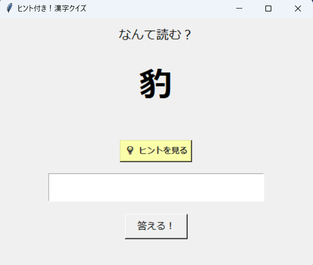

# Kanji Quiz App

## Overview

This is a simple Kanji quiz application built with Python.

The app displays a Kanji character, and the user inputs the correct reading.  
A hint can also be displayed to assist the user.

## Features

- Random Kanji quiz
- Hint display function
- Input answer and check correctness
- Easy customization via CSV file

## Use Case

- Learn difficult Kanji in a fun way
- Brain training
- Simple GUI practice with Python

## Tech Stack

- Python
- Tkinter
- CSV

## Project Structure

- main.py : application logic :contentReference[oaicite:1]{index=1}
- kanji.csv : quiz data

## How to Run

```bash
python main.py

### Screenshot



---

## 日本語

### 概要

Pythonで作成した難読漢字クイズです。
CSVファイルを読み込んでクイズを出題します。

### 機能

- 難読漢字クイズの出題
- ヒントの確認
- CSVファイルの変更でクイズの追加・変更・削除
- シンプルな操作

### 用途

- クイズ形式で楽しく学習する
- 頭の体操
- リラックス

### 技術スタック

- Python
- CSV

### 構成

- main.py : アプリ本体
- kanji.csv : 出題リスト

### 実行方法

    python main.py

### スクリーンショット


```
